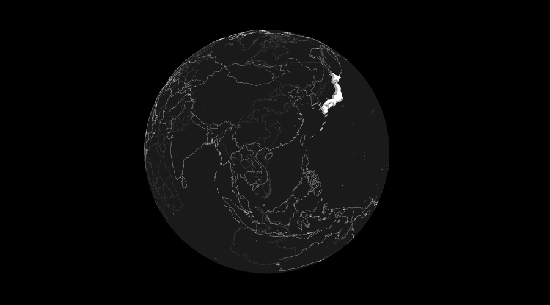

# three-geojson

[](https://github.com/gkjohnson/three-geojson/actions)
[](https://github.com/gkjohnson/three-geojson/)
[](https://twitter.com/garrettkjohnson)
[](https://github.com/sponsors/gkjohnson/)



Three.js shape loaders for [GeoJSON](https://geojson.org/) ([readable html](https://stevage.github.io/geojson-spec/)) and [WKT](https://en.wikipedia.org/wiki/Well-known_text_representation_of_geometry) formats. Supports generation of three.js line geometry in addition to flat and extruded tringulated meshes. All generated geometry are transformed and centered using 64-bit Javascript floating point operations with meshes are offset to retain precision in GPU operations.

Uses [@turfjs/unkink-polygon](https://www.npmjs.com/package/@turf/unkink-polygon), [@mapbox/delaunator](https://github.com/mapbox/delaunator), [@kninnug/constrainautor](https://github.com/kninnug/Constrainautor), amd [@placemark/betterknown](https://github.com/placemark/betterknown) packages for polygon triangulation and WKT parsing. World GeoJSON file courtesy of [geojson-maps](https://geojson-maps.kyd.au/).

Some key features supported by this project:
- Support for detecting and fixing self-intersecting polygons so they tringulate correctly.
- Uses constrained delaunay triangulation for correct, high quality triangulation and support for inner vertices.
- Smooth surface normals are generated for ellipsoid-projected shapes.
- Outputs centered geometry with and matrix transform offset to avoid preceision-related artifacts on CPU and GPU when processing high-detail shapes.

> [!NOTE]
> This project is not hosted on npm and must be installed via Github repository.

# Examples

[WGS84 Lines](https://gkjohnson.github.io/three-geojson/example/bundle/globe.html)

[WGS84 Extruded Polygons](https://gkjohnson.github.io/three-geojson/example/bundle/globe.html?country=.)

[Extruded Polygon](https://gkjohnson.github.io/three-geojson/example/bundle/extruded.html)

[WKT Polygon](https://gkjohnson.github.io/three-geojson/example/bundle/wkt.html)

# Use

```js
// load the content
const result = await new GeoJSON().loadAsync( url );

// extract polygon lines and project them onto the globe
const transformer = new GeoJSONTransformer();
result.polygons.forEach( polygon => {

  const line = polygon.getLineObject();
  transformer.transformObject( line );
  scene.add( line );

} );
```

# API

## GeoJSONResult

```ts
{
  // list of features in the file
  features: Array<Feature>,

  // list of all geometries in the file
  geometries: Array<Polygon|LineString|Points>,

  // lists of specific geometry types
  polygons: Array<Polygon>,
  lines: Array<LineString>,
  points: Array<Points>,
}
```

**Feature**

Definition of a feature that includes properties originally defined in the GeoJSON file.

```ts
{
  type: 'Feature',
  id: string | null,
  properties: object,

  // list of all geometries in the feature
  geometries: Array<Polygon|LineString|Points>,

  // lists of specific geometry types
  polygons: Array<Polygon>,
  lines: Array<LineString>,
  points: Array<Points>,
}
```

**Points**

Definition of a parsed set of point geometry.

```ts
{
  type: string,
  feature: Feature,
  data: Vector3 | Array<Vector3>,
}
```

**LineString**

Definition of a parsed set of line string geometry. `Ellipsoid` is from the 3d-tiles-renderer project.

```ts
{
  type: string,
  feature: Feature,

  // function for building three.js LineSegments from the line data
  getLineObject( options: {
    flat = false: boolean,
    offset = 0: number,
    ellipsoid = null: Ellipsoid,
    resolution = null: number,
  } ): LineSegments,
}
```

**Polygon**

Definition of a parsed set of polygon geometry. `Ellipsoid` is from the 3d-tiles-renderer project.

```ts
{
  type: string,
  feature: Feature,

  // functions for building three.js LineSegments and Mesh from the line data
  getLineObject( options: {
    flat = false: boolean,
    offset = 0: number,
    ellipsoid = null: Ellipsoid,
    resolution = null: number,
  } ): LineSegments,

  getMeshObject( options: {
    thickness = 0: number,
    offset = 0: number,
    flat = false: boolean,
    ellipsoid = null: Ellipsoid,
    resolution = null: number,
  } ): Mesh,
}
```

## GeoJSONLoader

### fetchOptions

```js
fetchOptions = {}: object
```

Options passed to fetch.

### loadAsync

```js
loadAsync( url: string ): Promise<GeoJSONResult>
```

Loads and parses a geojson file.

### parse

```js
parse( content: string | object ): GeoJSONResult
```

Parses geojson content. Takes a raw or stringified json object.

## WKTLoader

_extends GeoJSONLoader_

Loads and converts the WKT file to GeoJSON using [mapbox's wellknown](wellknown parser](https://github.com/mapbox/wellknown)) package, then parses it using the GeoJSONLoader parse function.
